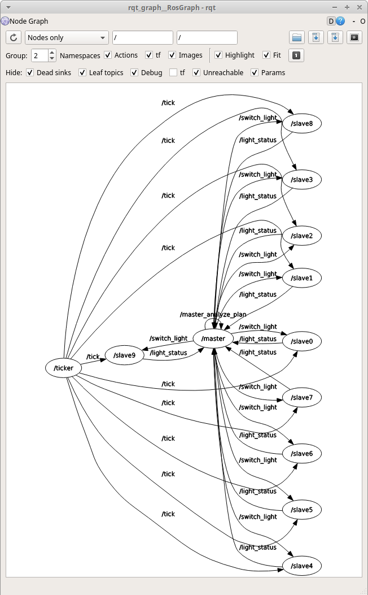
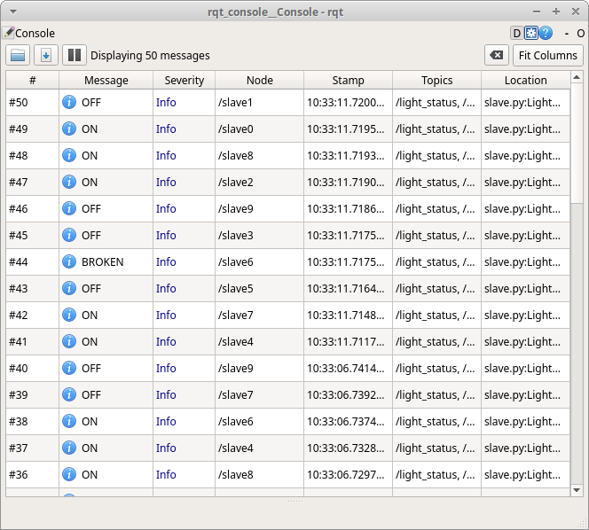

### Run the demo
1. Activate your workspace.
```bash
cd /path/to/your/catkin_workspace
source devel/setup.bash
```
2. Launch the demo using `roslaunch`.
```bash
roslaunch mapek_framework_demo demo.launch
```
3. (Optional) Inspect nodes using `rqt_graph` and `rosrun rqt_console rqt_console`.


